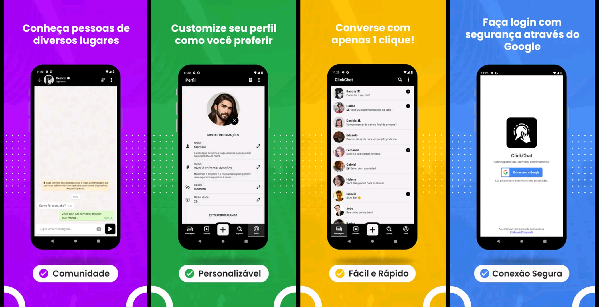

# If we can imagine it, we can do it. 🚀

### Hi, i'm Mauricio... 👋

- 👨‍💻 A **Full-Stack** Developer with a deep interest in **technology** and **challenging projects**.
- 💡 Focused on **innovation**, **intelligent automation**, **cloud computing** and **cross-platform** development.  
- 🌱 Currently learning: **Artificial Intelligence**, **Software Architectures** and **Clean Code**.
- 🚀 Looking for opportunities to **grow as a developer** and contribute to **impactful solutions**.

### 🧠 Core Technologies

### 🧩 Complementary Skills

## 🚀 Check out my featured project: ClickChat

**ClickChat** is a real-time messaging app built with **React Native**, featuring:

- 🧩 WebSocket communication  
- 🔐 Google Sign-In with Firebase  
- 🔊 Audio and image sharing  
- 💬 Emoji picker, dark/light mode, and push notifications  
- 🎧 Future support for voice calls and end-to-end encryption  

🔗 [Explore the repository →](https://github.com/gitmachado/click-chat-client)

## Contact

